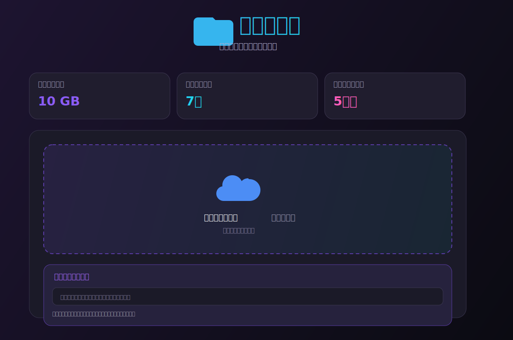

# 文件中转站 | File Transfer

这是一个基于 Cloudflare Workers + R2 的文件中转站项目，当前仓库为公开 fork/二改版本。

[](https://linux.do/)

## Fork 说明

- 源项目：[SMNETSTUDIO/File-Transfer](https://github.com/SMNETSTUDIO/File-Transfer)
- 本仓库基于上游项目进行二次修改与公开分发
- 当前仓库继续沿用 `Apache License 2.0`

如果你准备把本项目公开到 GitHub，建议在仓库描述或 README 中继续明确写明：

- `Forked from: <原项目仓库地址>`
- `This repository contains custom modifications`

## 本 Fork 增加/调整了什么

- 上传记录支持从 R2 元数据恢复，Worker 重新部署后仍可重新读取历史记录
- 上传记录新增删除按钮，可直接从 R2 中移除文件
- 删除操作改为确认弹窗，避免误删
- 上传记录显示文件剩余有效时间，而不是只显示文件大小
- 分享二维码改为弹窗展示，点击二维码可复制分享链接
- 上传记录恢复完整分享链接显示，并优化为单行截断布局
- 顶部状态卡改为显示剩余存储空间
- 新增存储空间统计逻辑，按 10GB 总容量计算已用/剩余空间
- 当存储空间已满，或待上传文件大于剩余空间时，前后端都会阻止上传

## 效果图



## 现有功能

- 大文件上传
- 分片上传
- 文件分享密码
- 全局访问密码
- 文件过期自动清理
- 临时下载直链
- 二维码分享
- 多文件并发上传

## 项目结构

- `worker.js`：主程序，前端页面与 Worker API 都在这个文件中
- `schema.sql`：原项目附带的 SQL 文件
- `LICENSE.txt`：Apache License 2.0 文本

## 部署方式

这个项目目前是单文件 Worker 方案。正常情况下，部署时只需要部署 `worker.js`，并绑定好 R2。

### 1. 创建 Worker

可以用 Cloudflare Dashboard，也可以用 `wrangler`。

```bash
wrangler login
wrangler init file-transfer
```

### 2. 创建 R2 Bucket

在 Cloudflare Dashboard 中创建一个 R2 Bucket。

默认配置下，代码里使用的桶名是：

```js
BUCKET_NAME: 'file-transfer'
```

如果你使用别的桶名，请同步修改 `worker.js` 里的 `CONFIG.BUCKET_NAME`。

### 3. 绑定 R2 Bucket

如果你使用 `wrangler.toml`，可参考：

```toml
[[r2_buckets]]
binding = "file-transfer"
bucket_name = "file-transfer"
```

### 4. 部署 Worker

```bash
wrangler deploy
```

如果你使用 Cloudflare Dashboard，直接将 `worker.js` 内容更新后重新发布即可。

## 配置项

请直接编辑 `worker.js` 顶部的 `CONFIG`：

```js
const CONFIG = {
  BUCKET_NAME: 'file-transfer',
  ACCESS_PASSWORD: '',
  SHARE_SECRET_KEY: '',
  TEMP_LINK_EXPIRE: 5 * 60 * 1000,
  MAX_FILE_SIZE: 100 * 1024 * 1024 * 1024,
  STORAGE_LIMIT: 10 * 1024 * 1024 * 1024,
  FILE_EXPIRE_TIME: 7 * 24 * 60 * 60 * 1000,
  ALLOWED_TYPES: [],
  CUSTOM_DOMAIN: '',
  MAX_CONCURRENT_UPLOADS: 3,
  CHUNK_SIZE: 50 * 1024 * 1024,
  MULTIPART_THRESHOLD: 100 * 1024 * 1024,
};
```

### 配置说明

- `ACCESS_PASSWORD`：站点全局访问密码，留空则不启用
- `SHARE_SECRET_KEY`：临时下载签名密钥，建议生产环境务必自定义
- `TEMP_LINK_EXPIRE`：临时下载直链有效期，默认 5 分钟
- `MAX_FILE_SIZE`：单文件上传上限
- `STORAGE_LIMIT`：用于计算剩余空间的总容量，当前默认按 R2 Free 的 10GB 设置
- `FILE_EXPIRE_TIME`：文件分享有效期，默认 7 天，设为 `0` 表示永不过期
- `CUSTOM_DOMAIN`：自定义域名，可选
- `MAX_CONCURRENT_UPLOADS`：前端并发上传文件数
- `CHUNK_SIZE`：分片大小
- `MULTIPART_THRESHOLD`：超过该大小自动走分片上传

## 当前行为说明

### 分享链接与临时下载链接

页面中看到的分享链接通常是固定入口，例如：

```text
/d/{fileId}
```

这个入口链接本身不会因为 5 分钟到了就变化。

真正只有 5 分钟有效的是点击下载后生成的临时下载直链，形式类似：

```text
/d/{fileId}?token=...&expires=...
```

会变化的是 `token` 和 `expires`，不是 `fileId`。

### 剩余存储空间是如何计算的

Cloudflare Worker 侧当前没有直接返回“桶剩余空间”的现成接口可用，因此本项目采用以下方式计算：

1. 遍历 R2 中 `_meta/` 下的文件元数据
2. 汇总已上传文件的 `size`
3. 用 `STORAGE_LIMIT - 已用大小` 得到剩余空间

这也是顶部“剩余存储空间”卡片的来源。

### 为什么重新部署后还能显示上传记录

上传记录不是保存在页面内存里，而是会在页面初始化时重新读取 R2 的 `_meta/` 元数据，因此重新部署 Worker 后，只要元数据还在，上传记录就能恢复显示。

## 相关接口

### 获取上传凭证

```http
POST /api/upload-url
Content-Type: application/json

{
  "filename": "example.zip",
  "size": 104857600,
  "type": "application/zip",
  "password": "optional-share-password"
}
```

### 上传记录列表

```http
GET /api/files
```

### 当前存储空间

```http
GET /api/storage
```

### 删除文件

```http
POST /api/file/delete
Content-Type: application/json

{
  "fileId": "..."
}
```

## 使用与公开注意事项

### Apache 2.0 下你需要保留的内容

- 保留 `LICENSE.txt`
- 保留上游项目原有版权与归属声明
- 对你修改过的文件，建议在提交记录、README 或发布说明中明确说明“此仓库包含修改”
- 如果上游项目后来包含 `NOTICE` 文件，你在继续分发时也应一并保留其要求的归属说明

### 公开 fork 时建议这样做

- 在 README 中明确写明 fork 来源
- 不要让仓库名称、描述或 README 让人误以为这是原作者官方仓库
- 如果你继续大幅修改，建议增加一个“与上游差异”章节

### Cloudflare 相关注意事项

- Cloudflare Workers 免费版有请求额度限制
- R2 Free 套餐通常有总容量限制与流量限制
- 分片上传受 Worker 运行时与请求体大小限制影响
- 本项目当前将总容量按 `10GB` 计算，请根据你的实际套餐自行调整 `STORAGE_LIMIT`

## 许可证

本仓库继续使用 `Apache License 2.0`。
